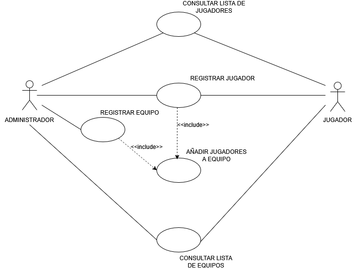
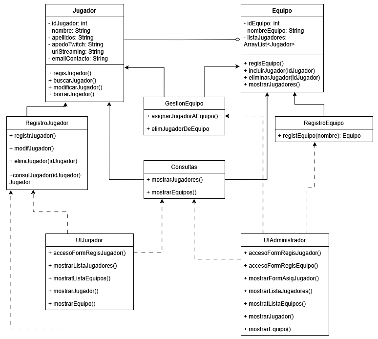

# Sistema de Gestión de Torneos de eSports 
## Autor 
Patricia Victoria Sanz López
[Tu perfil de GitHub ](https://github.com/pvicSL/)

## Descripción del Proyecto 

https://github.com/pvicSL/torneo-esports-uml.git 

Este proyecto implementa un sistema de gestión de torneos de eSports utilizando UML para el modelado.

TODO EL CONTENIDO INCLUIDO A CONTINUACIÓN (Y ALGUNAS NOTAS ADICIONALES) ESTÁ PRESENTE EN EL DOCUMENTO PDF INCLUIDO EN EL REPOSITORIO, DONDE DESARROLLO LA ACTIVIDAD SIGUIENDO EL ENUNCIADO Y SE PUEDEN OBSERVAR LOS DIAGRAMAS JUNTO CON SUS EXPLICACIONES, ASÍ COMO TABLAS PARA REPRESENTAR LAS CLASES CON SUS ATRIBUTOS Y MÉTODOS.

## Análisis del problema y requisitos del sistema
Para esta actividad, he planteado el sistema de gestión de eSports como si se tratase de una aplicación que permite a los administradores que la usan crear sus propios torneos, inscribir a los jugadores y actualizar los resultados de las partidas para informar al público. Según mi planteamiento, el público está constituido por espectadores que siguen las partidas en servicios de streaming como Twitch.

Además, he planteado que los jugadores también podrían acceder al sistema, para realizar una auto inscripción y consultar la lista de jugadores inscritos o la lista de equipos, por ejemplo. Lo he conceptualizado así porque, sin tener más información en el enunciado, y dado que se trata de eSports, podría darse el caso de que los jugadores de los equipos sean streamers que necesitan acceder a esa información para ofrecérsela a sus suscriptores como aliciente para seguir el torneo.

¿Quiénes son los actores que interactúan con el sistema?
    De acuerdo con mi planteamiento del sistema, los actores son: administradores y jugadores.

¿Cuáles son las acciones que cada actor puede realizar?

    Administrador: dentro del caso de uso que nos atañe (punto 1 del apartado 2), un administrador puede registrar un equipo, añadir (o eliminar) jugadores a un equipo, consultar la lista de equipos y consultar la lista de jugadores.

    Jugador: un jugador podría registrarse en el sistema, consultar la lista de equipos, si se le asigna uno, para ver en cuál se encuentra y consultar la lista de jugadores total o de cada equipo, para saber quiénes son sus rivales.

¿Cómo se relacionan entre sí las entidades del sistema?

    Entendiendo las entidades como si se tratasen de las que estarían presentes en un diagrama E-R, tendríamos una entidad EQUIPO y otra entidad JUGADOR. Un equipo podría tener entre uno y muchos jugadores, mientras que un jugador pertenece a ningún equipo o solo a uno.

    Además, para poder añadir los jugadores a un equipo, el administrador debe haberlos registrado, o ellos mismo deben haberse registrado. Por lo tanto, la acción de “registrar equipo” tendría una relación de dependencia con respecto a la de “añadir jugadores” (un <<include>>).
    
    Esto nos da una idea un poco más clara sobre el aspecto que va a tener el diagrama de casos de uso.

## Identificación de los casos de uso y elaboración del diagrama
Gestión de equipos y jugadores:
    ▪Registrar equipo.
    ▪Añadir jugadores a un equipo.
    ▪Consultar lista de equipos y jugadores.

    Puesto que en el apartado anterior he identificado los actores, entidades y usos para el modelo, a continuación, se incluye el diagrama de casos de uso correspondiente a este subapartado:

## Diagramas UML 
### Diagrama de Casos de Uso 

Como se puede observar en el diagrama, he incluido los dos actores que había identificado para mi sistema, el administrador y el jugador.

El administrador puede ‘registrar jugadores’, ‘registrar equipos’ (he considerado que en este sistema se puede registrar un equipo, con su nombre e id, aunque aún no se le hayan incluido los jugadores), y ‘añadir jugadores a un equipo’.

Además, el administrador también puede realizar dos tipos de consulta, ‘consultar lista de equipos’ y ‘consultar lista de jugadores’. En ambos casos, se podría plantear una relación de dependencia, de modo que la consulta de equipos requiriese la existencia de equipos, y la consulta de jugadores la existencia de al menos un registro de un jugador. Sin embargo, imaginando cómo podría ser el uso del sistema por parte de un usuario real, podría darse el caso de que se realice una consulta, aunque aún no se hayan introducido datos, simplemente como comprobación de que no hay equipos o jugadores de otras temporadas inscritos en el sistema. De modo que no he creado una relación de dependencia entre esos casos de uso por ese motivo.

Por su parte, el jugador puede auto inscribirse en el sistema (‘registrar jugador’), y realizar consultas de las listas de jugadores y equipos (‘consultar lista de equipos’ y ‘consultar lista de jugadores’), pero no puede hacer nada más en este sistema tal y como lo he planteado.

Los casos de uso son:
    Registrar jugador: una acción que permite al administrador o a un usuario incluir los datos de un jugador en la base de datos del torneo.

    Registrar equipo: un uso con el que un administrador puede crear un equipo para asignarle posteriormente los jugadores pertinentes.

    Añadir jugadores al equipo: que permite a los administradores incluir jugadores que estén inscritos en la base de datos dentro de un equipo creado.

    Consultar lista de equipos: disponible para administradores y usuarios, permite consultar la lista de equipos existentes en el torneo.

    Consultar lista de jugadores: permite a administradores y usuarios ver una lista de todos los jugadores inscritos.

## Identificación de clases y relaciones
### Diagrama de Clases 
 

Dado el esquema anterior de casos de uso, y mi planteamiento del sistema, considero que existen las siguientes clases (para esta parte, he tenido que consultar a qué se refería este tipo de división de clases, ya que no lo había visto antes):

    Clases de entidad (las que permiten modelar los datos):

        ▪ Jugador
        ▪ Equipo
                    +-----------------------------------------------+
                    |                   Jugador                     |
                    +-----------------------------------------------+
                    | - idJugador: int                              |
                    | - nombre: String                              |
                    | - apellidos: String                           |
                    | - apodoTwitch: String                         |
                    | - urlStreaming: String                        |
                    | - emailContacto: String                       |
                    +-----------------------------------------------+
                    | + regisJugador(nombre, apellidos,             | 
                    |   apodoTwitch, urlStreaming, emailContacto)   |
                    | + buscarJugador()                             |
                    | + modificarJugador(nombre, apellidos,         |
                    |   apodoTwitch, urlStreaming, emailContacto)   |
                    | + borrarJugador()                             |
                    +-----------------------------------------------+
                    +----------------------------------+
                    |              Equipo              |
                    +----------------------------------+
                    | - idEquipo: int                  |
                    | - nombreEquipo: String           |
                    | - listaJugadores: List<Jugador>  |
                    +----------------------------------+
                    | + regisEquipo(nombreEquipo)      |
                    | + incluirJugador(idJugador)      |
                    | + eliminarJugador(idJugador)     |
                    | + mostrarJugadores()             |
                    +----------------------------------+

    Clases de control (las que comunican la vista con el modelo de datos):

        ▪ RegistroJugador
        ▪ RegistroEquipo
        ▪ GestionEquipo
        ▪ Consultas

                    +----------------------------------+
                    |           RegistroJugador        |
                    +----------------------------------+
                    | + registrJugador()               |
                    | + modifJugador()                 |
                    | + elimiJugador(int id)           |
                    | + consulJugador(int id): Jugador |
                    +----------------------------------+

                    +---------------------------------------+
                    |           RegistroEquipo              |
                    +---------------------------------------+
                    | + registEquipo(String nombre): Equipo |
                    +---------------------------------------+

                    +------------------------------------------------------+
                    |                      GestionEquipo                   |
                    +------------------------------------------------------+
                    | + asignarJugadorAEquipo(int idEquipo, int idJugador) |
                    | + elimJugadorDeEquipo(int idEquipo, int idJugador)   |
                    +------------------------------------------------------+

                    +-------------------------------------+
                    |            Consultas                |
                    +-------------------------------------+
                    | + mostrarJugadores(): List<Jugador> |
                    | + mostrarEquipos(): List<Equipo>    |
                    +-------------------------------------+

    Clases de interfaz (las que presentan las vistas con las que interactúa el usuario):

        ▪ InterfazUsuario
        ▪ InterfazAdministrador
                +---------------------------------------------+
                |                 UIJugador                   |
                +---------------------------------------------+
                | + accesoFormRegisJugador()                  |
                | + mostrarListaJugadores()                   |
                | + mostrarListaEquipos()                     |
                | + mostrarJugador()                          |
                | + mostrarEquipo()                           |
                +---------------------------------------------+

                +------------------------------------------------+
                |               UIAdministrador                  |
                +------------------------------------------------+
                | + accesoFormRegisJugador()                     |
                | + accesoFormRegisEquipo()                      |
                | + mostrarFormAsigJugador()                     |
                | + mostrarListaJugadores()                      |
                | + mostrarListaEquipos()                        |
                | + mostrarJugador()                             |
                | + mostrarEquipo()                              |
                +------------------------------------------------+
    

    Además de la imagen del diagrama en la carpeta, incluyo su representación en texto plano:

        +------------------------+			                    +----------------------------------+
        |       Jugador          |           		            |              Equipo              |
        +------------------------+                    	    	+----------------------------------+
        | - idJugador: int       |                    	    	| - idEquipo: int                  |
        | - nombre: String       |      (Agregación)            | - nombreEquipo: String           |	
        | - apellidos: String    | ---------------------------<>| - listaJugadores: List<Jugador>  |
        | - apodoTwitch: String  |                    	    	+----------------------------------+
        | - urlStreaming: String |                       		| + regisEquipo()                  |
        | - emailContacto: String|                   	    	| + incluirJugador()               |
        +------------------------+                   	    	| + eliminarJugador()              |
        | + regisJugador()       |<---------|        |--------->| + mostrarJugadores()             |
        | + buscarJugador()      |          |        |  	    +----------------------------------+
        | + modificarJugador()   |          |        |       		↑		    ↑
        | + borrarJugador()      |          |        |       		|   		|
        +------------------------+   	    |        |			    |   		|
        ↑	↑   ↑                           |        |			    |   		|
        |	|	|	             	+--------------------------+    |   		|
        |	|	|		            |      GestionEquipo       |    |   		|
        |	|	|		            +--------------------------+    |   		|
        |	|	|		            | + asignarJugadorAEquipo()|<--------      	|
        |	|	|		            | + elimJugadorDeEquipo()  |    |   |		|
        |	|	|		            | + mostrarJugadores()     |    |   |		|
        |	|	|		            +--------------------------+    |   |		|
        |	|	|					                            	|   |		|	
        |	|	-------------------------------------       --------|   |		|
        |  +-------------------------+              |		|           |   +-------------------------+      
        |  |     RegistroJugador     |              |		|           |   |     RegistroEquipo      |
        |  +-------------------------+              |		|           |   +-------------------------+
        |  | + registrJugador()      |              |		|           |   | + registEquipo()        |
        |  | + modifJugador()        |              |		|           |   | + consulEquipo()        |
        |  | + elimiJugador()        |              |		|           |   +-------------------------+
        |  | + consulJugador()       |              |		|           |		    	↑
        |  +-------------------------+              | 		|           |		    	|
        |		↑			                        |		|           |		    	|
        |		|			                +---------------------+     -------------	|
        |		|			                |      Consultas      |         		|	|	
        |		|			                +---------------------+         		|	|
        |		|			                | + mostrarJugadores()|   	        	|	|
        |		|			                | + mostrarEquipos()  |  	        	|	|
        |		|			                +---------------------+            		|	|
        |	+---------------------------+	    ↑		    ↑		        +----------------------------+
        |	|       UIJugador           |	    |	        |		        |       UIAdministrador      |         
        |	+---------------------------+	    |	        |	        	+----------------------------+        
        |	| + accesoFormRegisJugador()|--------	    	----------------| + accesoFormRegisJugador() |      
        |	| + mostrarListaJugadores() |					                | + accesoFormRegisEquipo()  |      
        |	| + mostrarListaEquipos()   |					                | + mostrarFormAsigJugador() |    
        |	| + mostrarJugador()        |					                | + mostrarListaJugadores()  |      
        |	| + mostrarEquipo()         |					                | + mostrarListaEquipos()    |    
        |	+---------------------------+					                | 			                 | 
        |-------------------------------------------------------------------| 		            	     |
                                                                            +----------------------------+

Una vez diseñadas todas las clases y sus atributos, puedo establecer las relaciones que se dan entre ellas:

    Así, pues, habría una relación de agregación entre Equipo y Jugador, puesto que el equipo está formado por una lista de jugadores, pero los jugadores pueden existir en la base de datos, aunque no se les haya asignado aún un equipo (cardinalidad uno a muchos entre equipo y jugador, 1:N; y entre ninguno y uno entre jugador y equipo, 0:1).

    Habría relación de dependencia entre:
        RegistroJugador y Jugador
        RegistroEquipo y Equipo
        GestionEquipo y Equipo
        GestionEquipo y Jugador
        Consultas y Jugador
        Consultas y Equipo

La estructura del esquema UML representa todas las clases que he contemplado en el sistema:

    Las entidades Equipo y Jugador aparecen con sus atributos y métodos correspondientes. La relación de agregación entre ellas aparece representada por el rombo en el extremo de la línea, pero he incluido también un texto en caso de que este detalle no se aprecie, ya que su tamaño es bastante reducido.

    Las clases de control RegistroJugador, RegistroEquipo, GestionEquipo y Consultas únicamente contienen métodos.

    Las clases de interfaz, UIJugador y UIAdministrador también incluyen métodos.

## Estructura del Proyecto (PARTE DE JAVA NO REALIZADA - OPCIONAL)

    torneo-esports-uml/ 
    ├── src/ │ ├── es/empresa/torneo/ 
    │ │ ├── modelo/ 
    │ │ ├── control/ 
    │ │ ├── vista/ 
    │ │ ├── Main.java 
    ├── diagrams/ 
    │ ├── casos-uso.png 
    │ ├── clases.png 
    ├── README.md
    ├── .gitignore
    ├── ACT3_PVSL.pdf
    ├── LICENSE (opcional) 

## Instalación y Ejecución 

    1. Clonar el repositorio:
    `git clone https://github.com/pvicSL/torneo-esports-uml.git`

    2. Compilar y ejecutar el proyecto:
    `cd src javac es/empresa/torneo/Main.java java es.empresa.torneo.Main`

## Justificación del diseño Por qué se eligió esa estructura y cómo se organizan las clases.

Por una cuestión práctica (tiempo material disponible para realizar este ejercicio dada la carga de trabajo que tengo actualmente), he realizado únicamente los pasos obligatorios del enunciado. 

Esto quiere decir que no he desarrollado diagramas de casos de uso para todos los posibles usos del sistema. De haber podido así, creo que el diseño global habría sido más robusto, puesto que tener que analizar todas las casuísticas seguramente me habría llevado a realizar alguna modificación en planteamiento del diagrama que sí he desarrollado.

Dicho esto, el modelo sobre el que he trabajado, tal y como explicaba en la introducción, contempla que este sistema de gestión de torneos para eSports es una aplicación de escritorio pensada para tener dos tipos de usuarios principales: administradores (con más privilegios de uso) y usuarios. 
Los administrados pueden registrar jugadores, registrar equipos, asignar jugadores a los equipos y consultar las listas de ambas entidades. Los usuarios, por otro lado, pueden ser usuarios que deseen participar en los torneos y que realicen su inscripción en la base de datos a la espera de ser asignados a un equipo y posteriormente a las partidas que dispute este.

En los apartados de los diagramas he justificado en mayor profundidad el razonamiento que he seguido para crear los diagramas e identificar sus elementos.

## Conclusiones 

Aunque no hemos trabajado demasiados casos prácticos durante el trimestre, me he apoyado en lo posible en los ejemplos que hemos desarrollado en mayor o menos medida en las sesiones, así como en la información de los apuntes proporcionados por la plataforma.

Con todo esto en mente, he desarrollado el mejor modelo que mis conocimientos me han permitido en este punto del aprendizaje. La parte más abstracta para mí, y por lo tanto la más compleja, ha sido la del diagrama de casos de uso, por la plasticidad de planteamientos que permite. Aunque puedo apreciar la flexibilidad que aporta esto a un desarrollador con experiencia, para una principiante resulta un poco abrumador, es casi como si se tratase de una pizarra con infinitas posibilidades.

Sin embargo, a medida que esto se traduce a clases que posteriormente se implementarían en nuestro desarrollo, el conjunto empieza a estar más claro. La representación en el diagrama UML no me ha resultado tan compleja, aunque estoy segura de que poder hacer más ejercicios de este tipo me ayudaría a afianzar ciertos aspectos, como la representación de ciertas relaciones. Y seguramente también me serviría para simplificar los esquemas, ya que a medida que desarrollaba el mío, tenía la sensación de que había demasiadas conexiones y líneas.

En términos generales, estoy satisfecha con el resultado. A pesar de carecer de experiencia previa, creo que he podido crear unos diagramas y unas explicaciones coherentes para mis decisiones. Soy consciente de que hay aspectos por pulir y tengo la certeza de que habré cometido errores que ahora mismo no soy capaz de apreciar a simple vista, pero creo que el resultado demuestra el esfuerzo que he dedicado a comprender los conceptos teóricos y a aplicarlos en los distintos apartados.
